# Akash Console

Esse guia vai guiar você através do deploy de uma simples aplicação "Hello World" Next.JS em 5 minutos. O processo de deploy de qualquer outra aplicação é idêntico, apenas o arquivo sdl precisa ser alterado de acordo com a configuração e imagem do container.

[Clique aqui para assistir ao vídeo](https://www.youtube.com/embed/ZJaRzAR7uzU?si=Yp5e_xxgcaqq9dpV)

#### Antes de começar

Console é compatível com duas carteiras, Keplr e Leap. As extensões do navegador Keplr ou Leap devem ser instaladas e com fundos suficientes (0.5 AKT mínimo para uma única implantação, mais uma pequena quantia para taxas de transação).

Siga os [guias de criação de carteiras](/docs/getting-started/token-and-wallets/#keplr-wallet) ou [guias de criação de carteiras](/docs/getting-started/token-and-wallets/#leap-cosmos-wallet) para criar sua primeira carteira se necessário.

#### Acesso ao Akash Console

O aplicativo web do Akash Console está disponível via o seguinte URL:

- https://console.akash.network/

### Passo 1 - Conecte sua carteira Keplr ou Leap

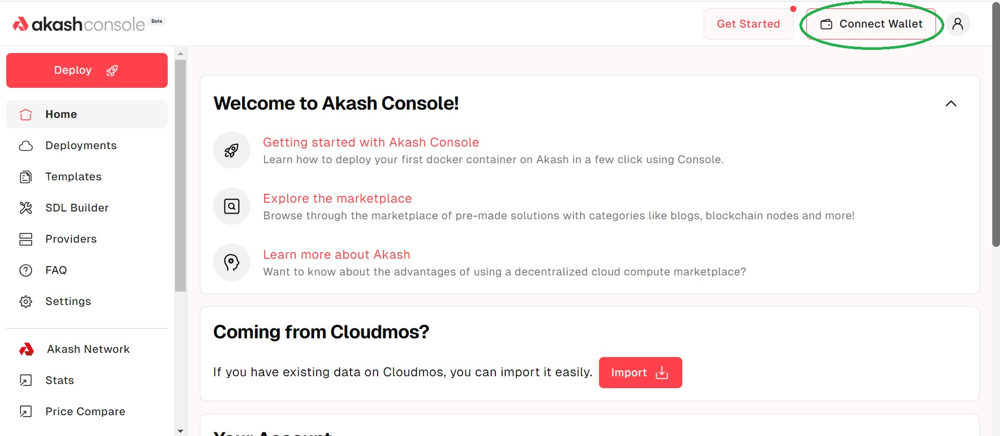

Depois de clicar em conectar carteira, você verá uma opção para escolher Keplr ou Leap. Escolha sua opção preferida:

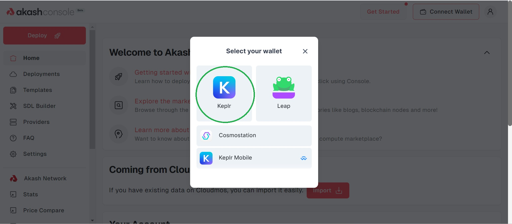

### Passo 2 - Clique na opção "Getting started with Akash Console"

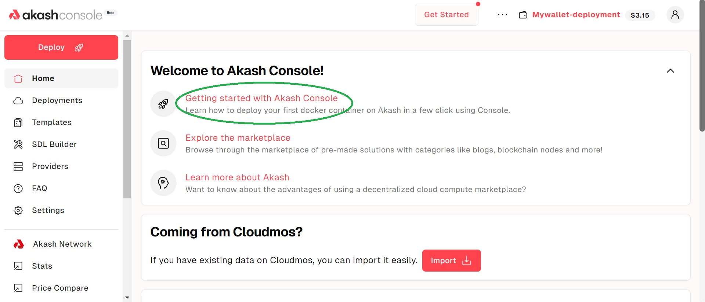

Agora clique no botão "Deploy!":

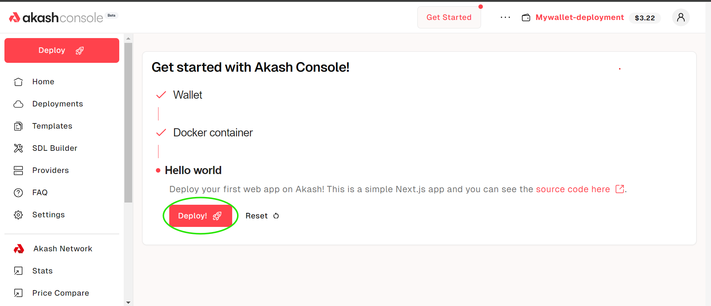

Agora, um arquivo sdl será carregado para sua implantação, que terá a imagem do docker e todos os recursos necessários especificados. Clique na opção "Create Deployment":

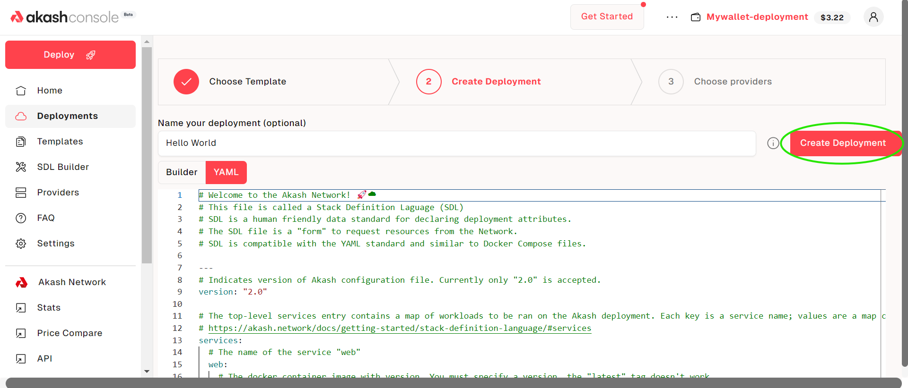

### Passo 3 - Continue para pagar o depósito de implantação

Clique no botão Continuar e aprove a transação:

Agora aprove a transação:

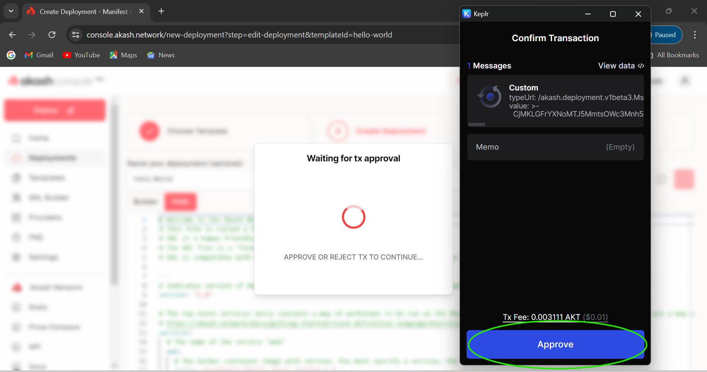

### Passo 4 - Selecione o melhor oferta

Agora você verá uma lista de provedores com preços. Selecione o que você quiser, preferencialmente o menor, e clique no botão "Accept Bid":

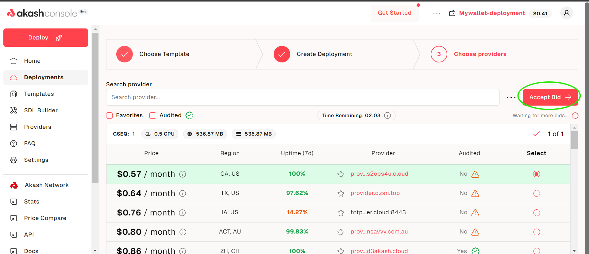

Agora aprove a taxa de transação novamente:

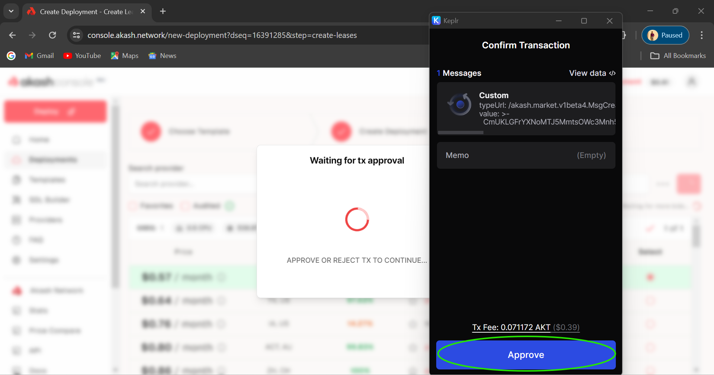

#### Passo 5 - Confirme a implantação

Agora a única coisa restante a fazer é confirmar que a implantação foi bem-sucedida. Clique na seção Ofertas:

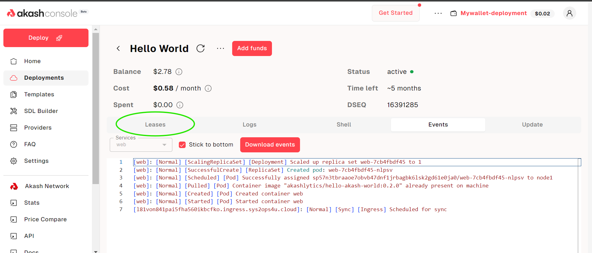

Agora visite o link URI:

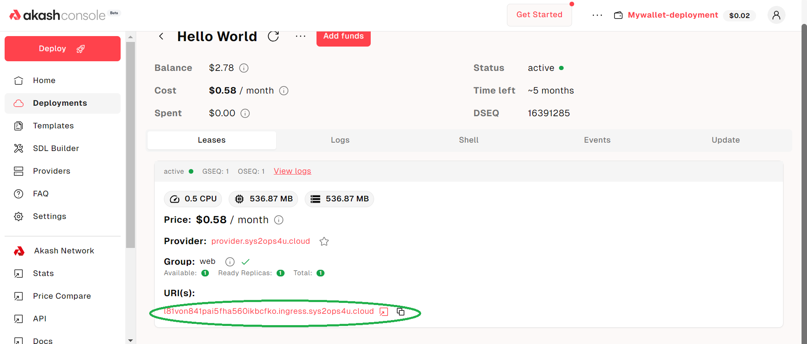

Você verá o site que acabou de implantar:

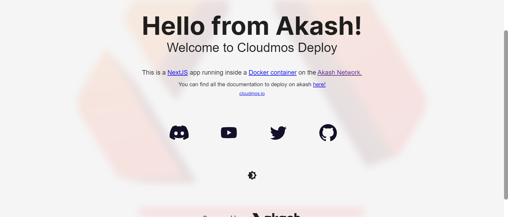

Uma vez que a aplicação "Hello World" está implantada, você pode fechá-la facilmente e obter reembolso. Basta clicar na opção Fechar e, novamente, aprovar a transação:

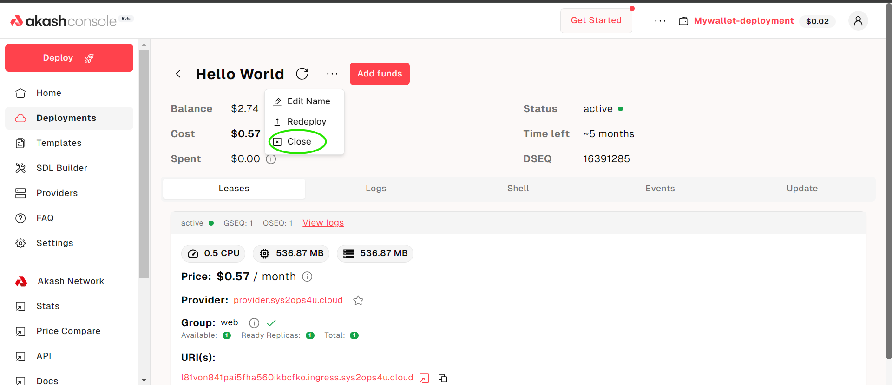

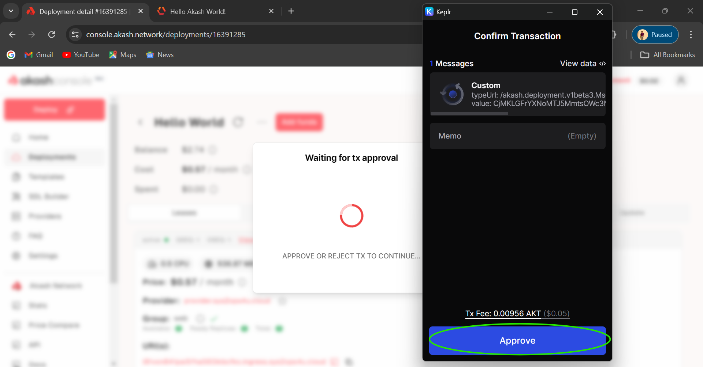

#### Conclusão

Você implementou com sucesso uma simples aplicação "Hello World" usando o Console. Siga o fluxo similar para outras implantações, apenas o arquivo sdl junto com a imagem do docker e os recursos devem ser configurados de acordo com a necessidade.
